2## 8.전공 대학생 학습자를 위해 제공되는 In-built Demo의 개수

### 8.1 시험 환경
    - 

### 8.2 시험 방법
    - 일반인 학습자 대상의 AI,딥러닝 학습 또는 체험을 위해 제공되는 Demo 및 예제에 대한 개수 측정
    

### 8.3 확인 항목
    - 5개의 Demo 예제가 있는지 확인

### 8.4 시험 결과
    - 5개의 Demo 예제 확인 완료

#### 별첨

1. Demo 예제(자율주행차) 1 - 라인 감지  
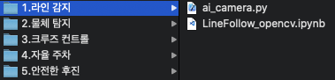</img>   
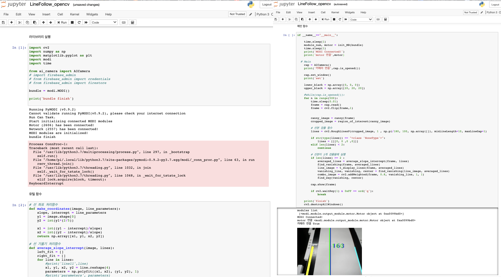</img>   

2. Demo 예제(자율주행차) 2 - 물체 감지  
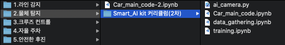</img>   
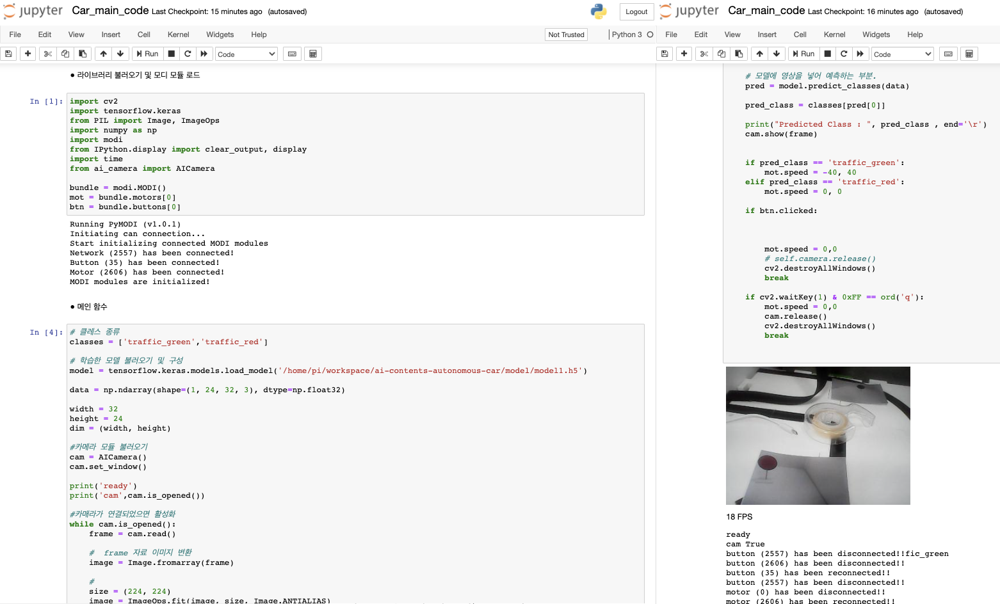</img>   

3. Demo 예제(자율주행차) 3 - 크루즈 컨트롤  
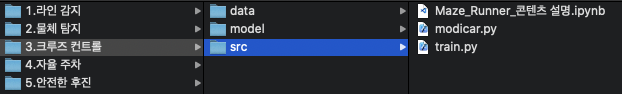</img>   
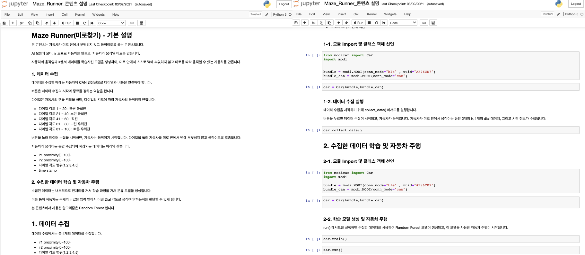</img>   

4. Demo 예제(자율주행차) 4 - 자율 주차  
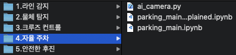</img>   
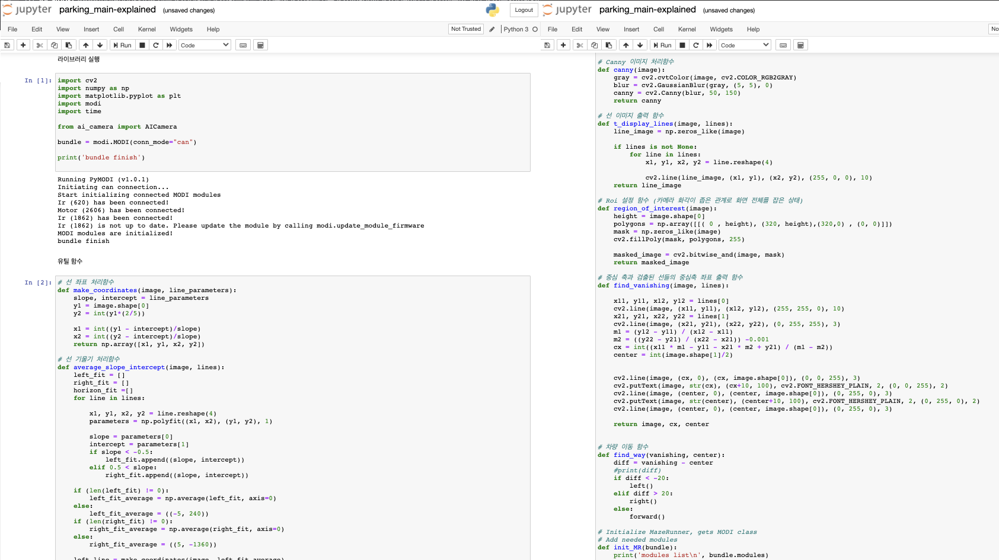</img>   
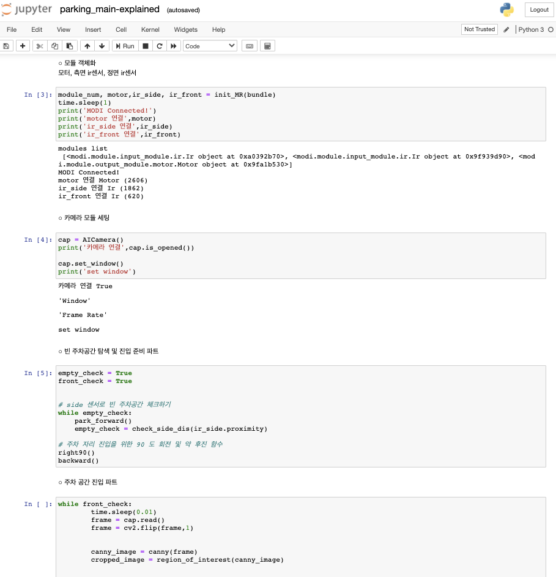</img>  

5. Demo 예제(자율주행차) 5 - 안전한 후진  
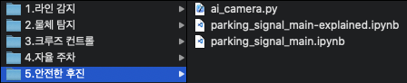</img>   
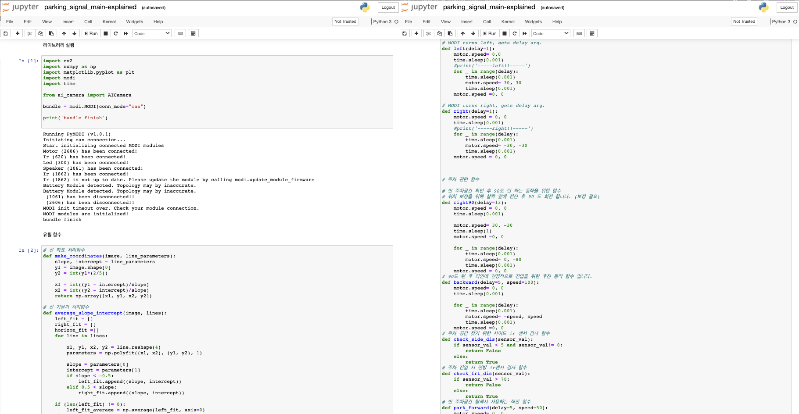</img>   
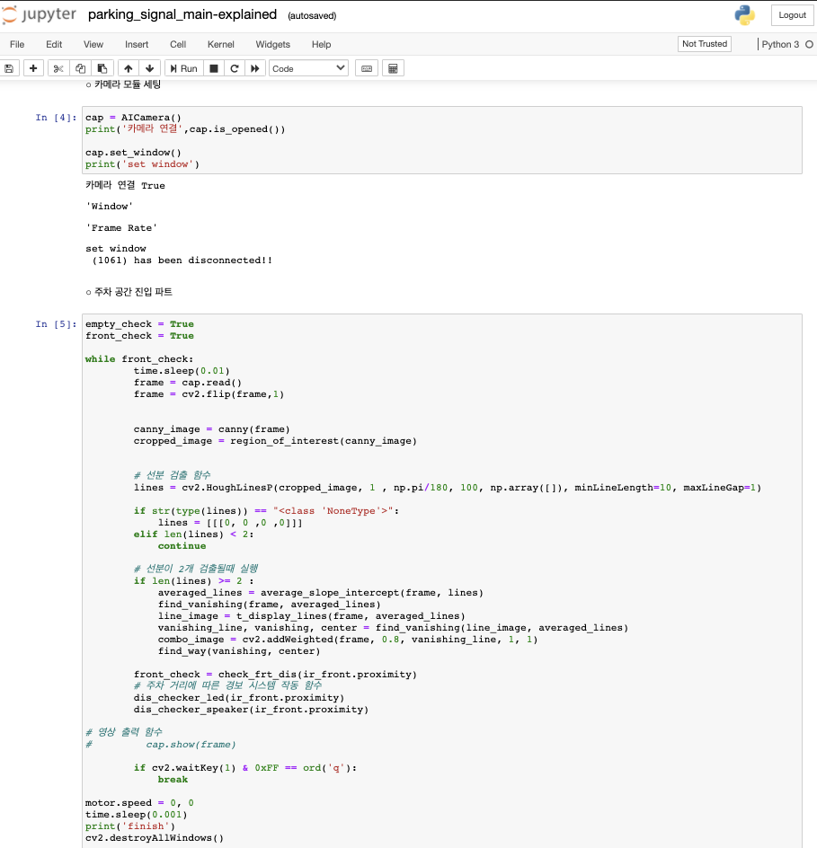</img>  