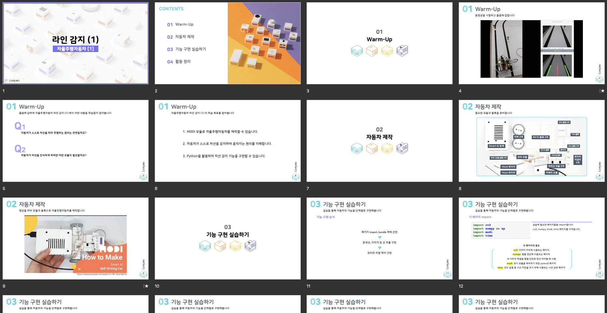
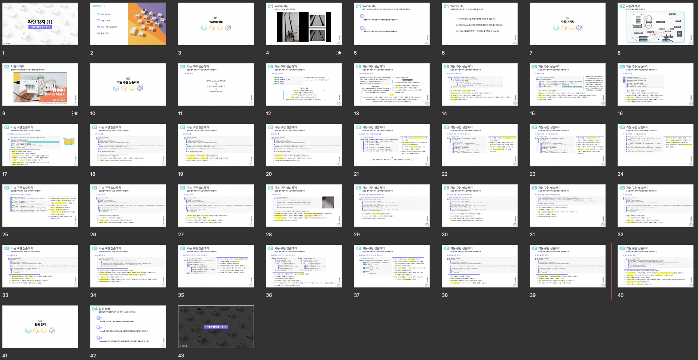
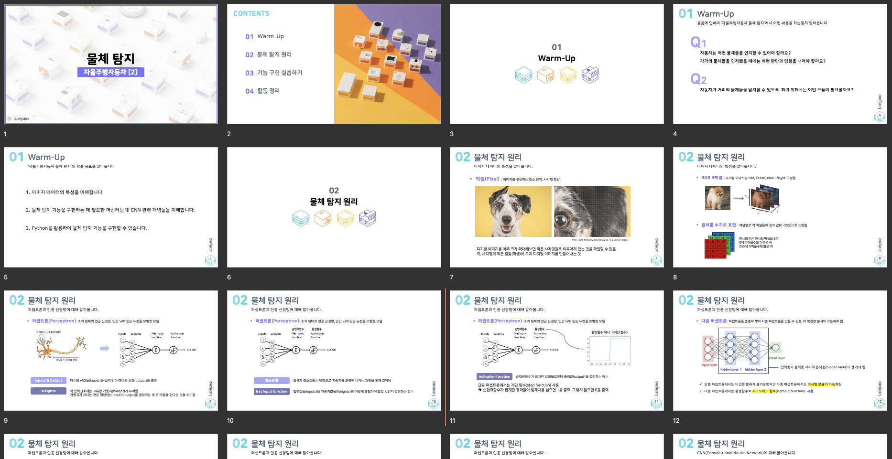
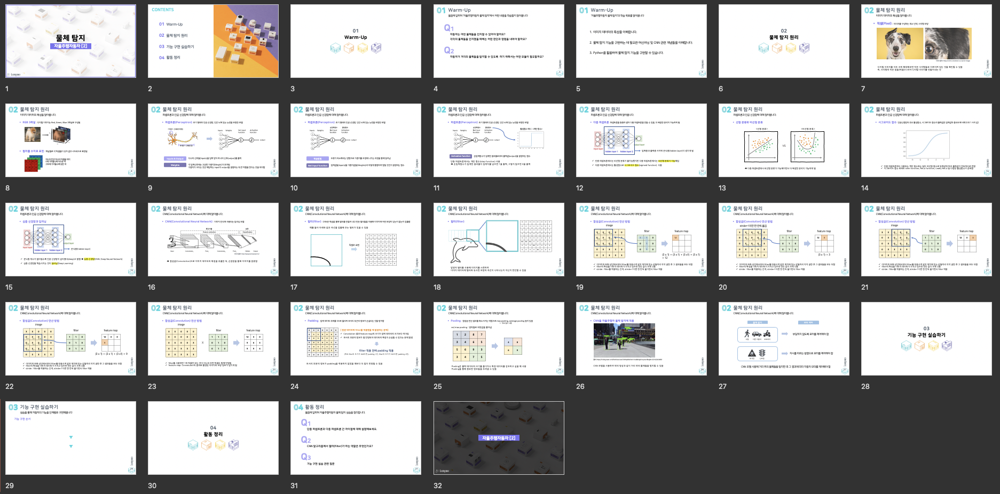
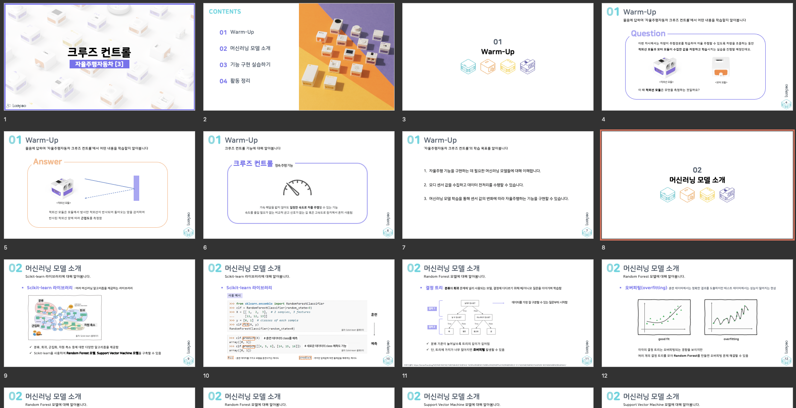
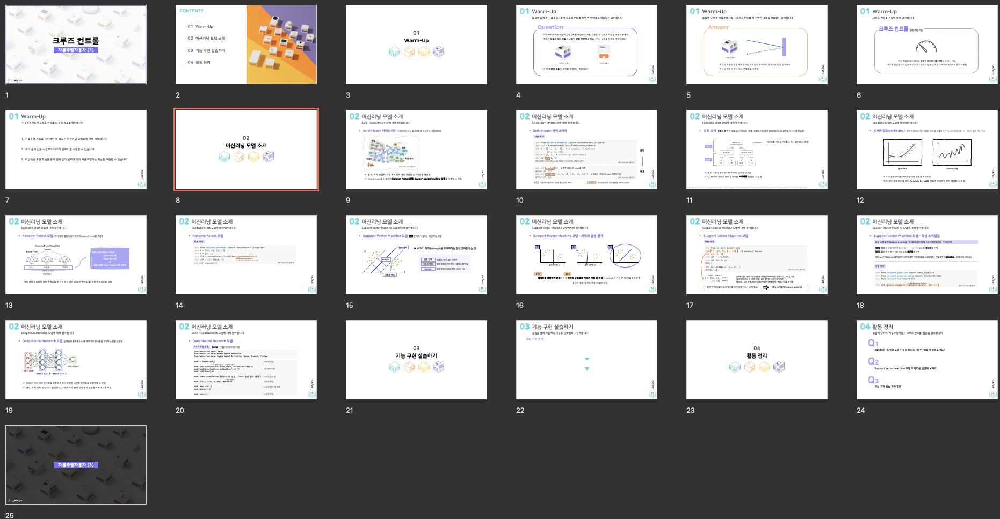
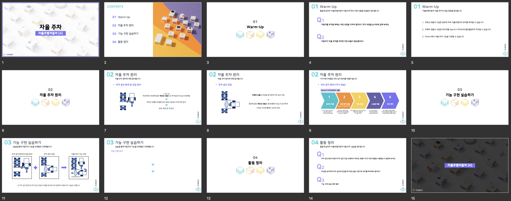
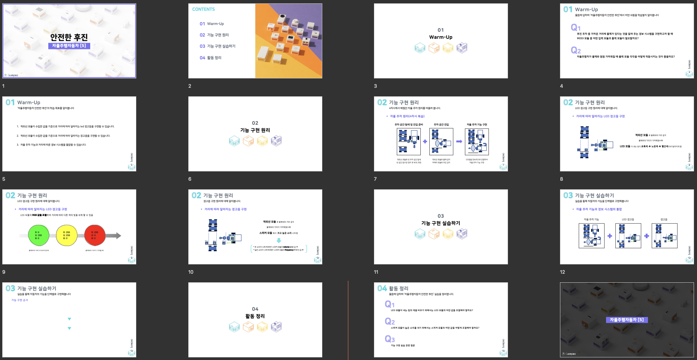

## 9.전공 대학생 학습자를 위해 제공되는 콘텐츠 및 커리큘럼의 개수

### 9.1 시험 환경
    - 

### 9.2 시험 방법
    - 전공 대학생 학습자 대상의 AI,딥러닝 학습 또는 체험을 위해 제공되는 학습자료에 대한 개수 측정
    

### 9.3 확인 항목
    - 5개의 학습자료가 있는지 확인

### 9.4 시험 결과
    - 5개의 학습자료 확인 완료
    

#### 1. 학습자료 1 - 라인 감지  
</img>  
</img>  

#### 2. 학습자료 2 - 물체 탐지  
</img>   
</img>  

#### 3. 학습자료 3 - 크루즈 컨트롤  
</img>  
</img>  

#### 4. 학습자료 4 - 자율 주차  
</img>   

#### 5. 학습자료 5 - 안전한 후진  
</img>   