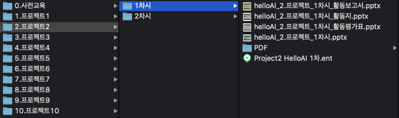
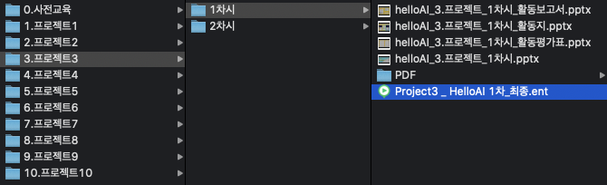

## 6.일반인 학습자를 위해 제공되는 In-built Demo의 개수

### 6.1 시험 환경
    - 

### 6.2 시험 방법
    - AI,딥러닝 학습 또는 체험을 위해 제공되는 Demo 및 예제에 대한 개수 측정
    

### 6.3 확인 항목
    - 5개의 Demo 예제가 있는지 확인

### 6.4 시험 결과
    - 5개 이상(19개)의 Demo 예제 확인 완료
    

* Demo 예시1 - 프로젝트3-2차시(Project3 _ HelloAI 2차_최종.ent)  
</img>  
* Demo 예시2 - 프로젝트9-2차시(Project9_HelloAI_2차_최종.ent)  
</img>  

1. Demo 예제 - 프로젝트1 1차시  
</img>  
2. Demo 예제 - 프로젝트1 2차시  
</img>  
3. Demo 예제 - 프로젝트2 1차시  
</img>  
4. Demo 예제 - 프로젝트2 2차시  
</img>  
5. Demo 예제 - 프로젝트3 1차시  
</img>  
6. Demo 예제 - 프로젝트3 2차시  
</img>  
7. Demo 예제 - 프로젝트4 1차시  
</img>  
8. Demo 예제 - 프로젝트4 2차시  
</img>  
9. Demo 예제 - 프로젝트5 1차시  
</img>  
10. Demo 예제 - 프로젝트5 2차시  
</img>  
11. Demo 예제 - 프로젝트6 1차시  
</img>  
12. Demo 예제 - 프로젝트6 2차시  
</img>  
13. Demo 예제 - 프로젝트7 1차시  
</img>  
14. Demo 예제 - 프로젝트7 2차시  
</img>  
15. Demo 예제 - 프로젝트8 1차시  
</img>  
16. Demo 예제 - 프로젝트8 2차시  
</img>  
17. Demo 예제 - 프로젝트9 1차시  
</img>  
18. Demo 예제 - 프로젝트9 2차시  
</img>  
19. Demo 예제 - 프로젝트10 1차시  
</img>  