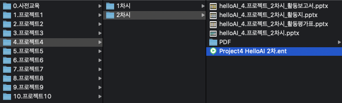

## 7.일반인 학습자를 위해 제공되는 콘텐츠 및 커리큘럼의 개수

### 7.1 시험 환경
    - 

### 7.2 시험 방법
    - 일반인 학습자 대상의 AI,딥러닝 학습 또는 체험을 위해 제공되는 학습자료의 개수 측정
    

### 7.3 확인 항목
    - 5개의 학습자료가 있는지 확인

### 7.4 시험 결과
    - 5개 이상(19개)의 학습자료(PPT) 확인 완료
    

* 학습자료 예시 - 프로젝트3-2차시(helloAI_6.프로젝트_2차시.pptx)  
</img>  
</img>  

1. Demo 예제 - 프로젝트1 1차시  
</img>  
2. Demo 예제 - 프로젝트1 2차시  
</img>  
3. Demo 예제 - 프로젝트2 1차시  
</img>  
4. Demo 예제 - 프로젝트2 2차시  
</img>  
5. Demo 예제 - 프로젝트3 1차시  
</img>  
6. Demo 예제 - 프로젝트3 2차시  
</img>  
7. Demo 예제 - 프로젝트4 1차시  
</img>  
8. Demo 예제 - 프로젝트4 2차시  
</img>  
9. Demo 예제 - 프로젝트5 1차시  
</img>  
10. Demo 예제 - 프로젝트5 2차시  
</img>  
11. Demo 예제 - 프로젝트6 1차시  
</img>  
12. Demo 예제 - 프로젝트6 2차시  
</img>  
13. Demo 예제 - 프로젝트7 1차시  
</img>  
14. Demo 예제 - 프로젝트7 2차시  
</img>  
15. Demo 예제 - 프로젝트8 1차시  
</img>  
16. Demo 예제 - 프로젝트8 2차시  
</img>  
17. Demo 예제 - 프로젝트9 1차시  
</img>  
18. Demo 예제 - 프로젝트9 2차시  
</img>  
19. Demo 예제 - 프로젝트10 1차시  
</img>  